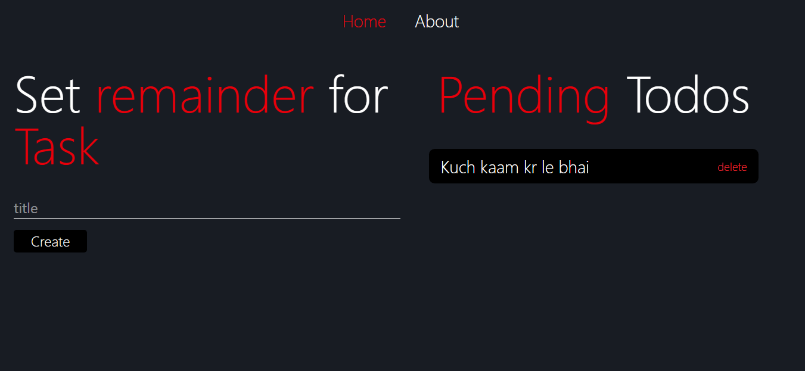

# 🧾 React Todo App

This is a simple Todo application for desktop built using **React** and **Tailwind CSS**. It allows users to **create**, **view**, and **delete** tasks efficiently.

## 🚀 Features

- ✅ Add new todos
- 📋 Display all todos
- ❌ Delete a todo
- 💅 Styled using Tailwind CSS
<!-- - ⚡ Fast and responsive UI -->

## 🛠️ Tech Stack

- **React** – Frontend library
- **Tailwind CSS** – Utility-first CSS framework

## 📸 Screenshots

*

## 📦 Installation

```bash
git https://github.com/rao-ankit-9001/Todo-App-React.git
cd Todo-App-React
npm install
npm run dev


# Folder Structure
    src/
├── components/
│   └── About.jsx
│   └── CreateTodo.jsx
│   └── Home.jsx
│   └── RenderTodos.jsx
│   └── Routers.jsx
├── App.jsx
├── index.js
├── main.js
├── Todocontext.js

